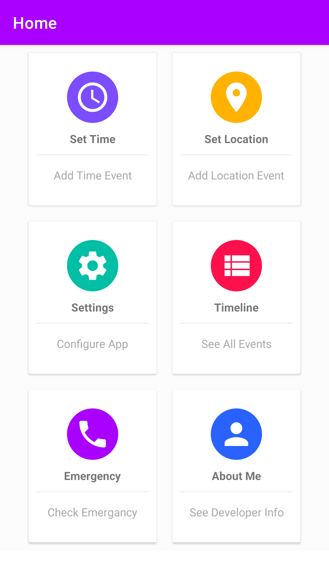
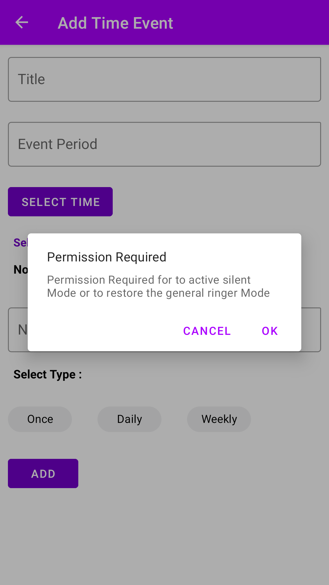
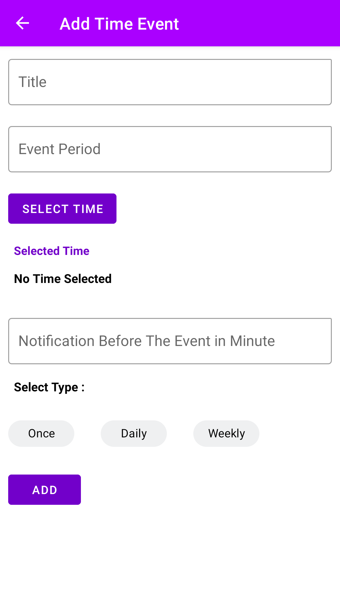
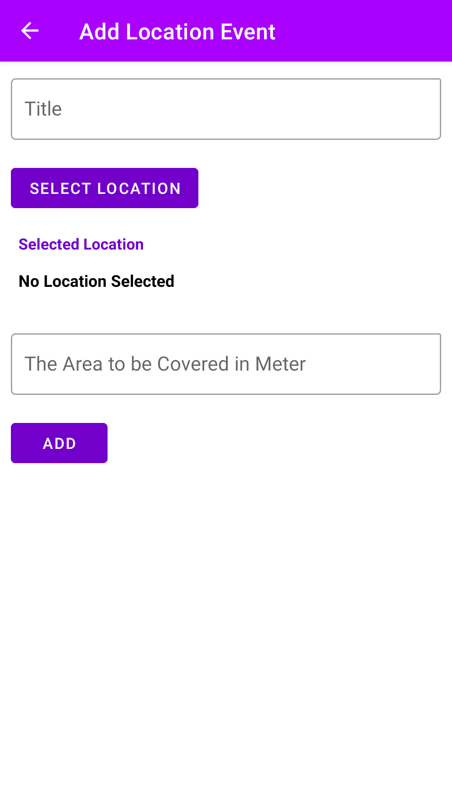
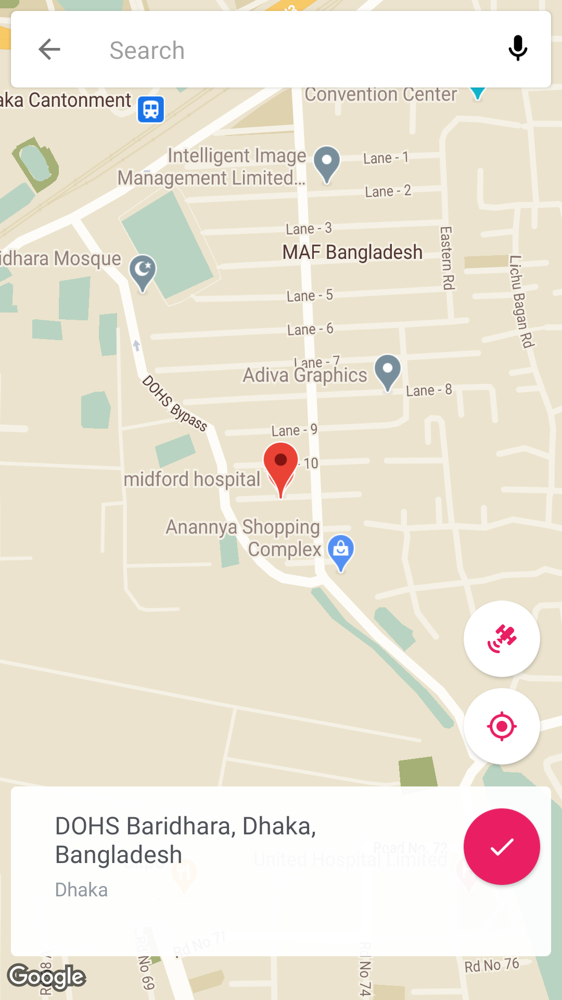
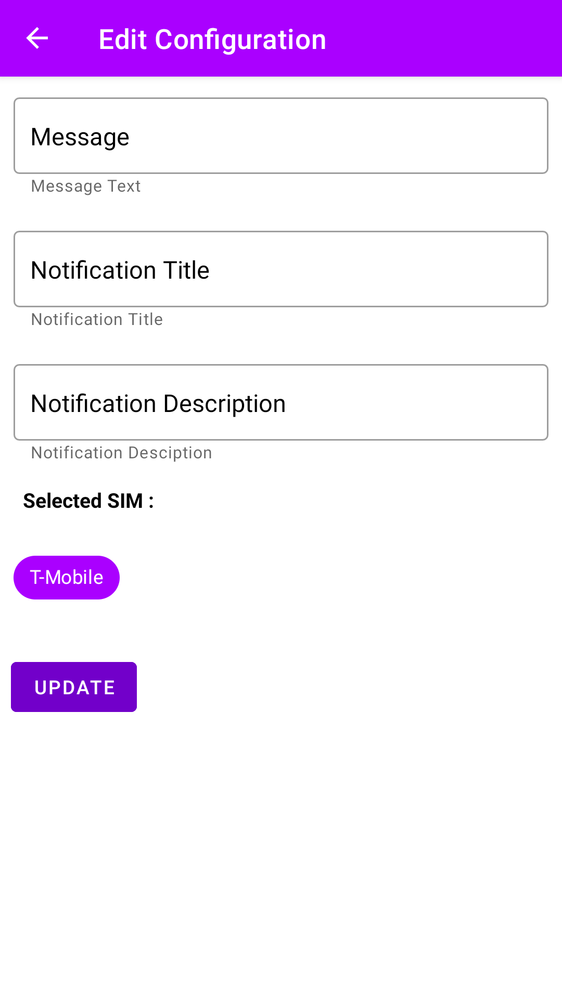
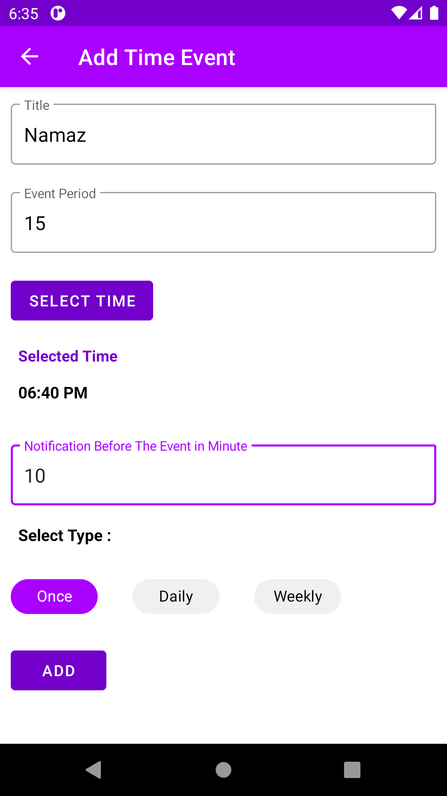
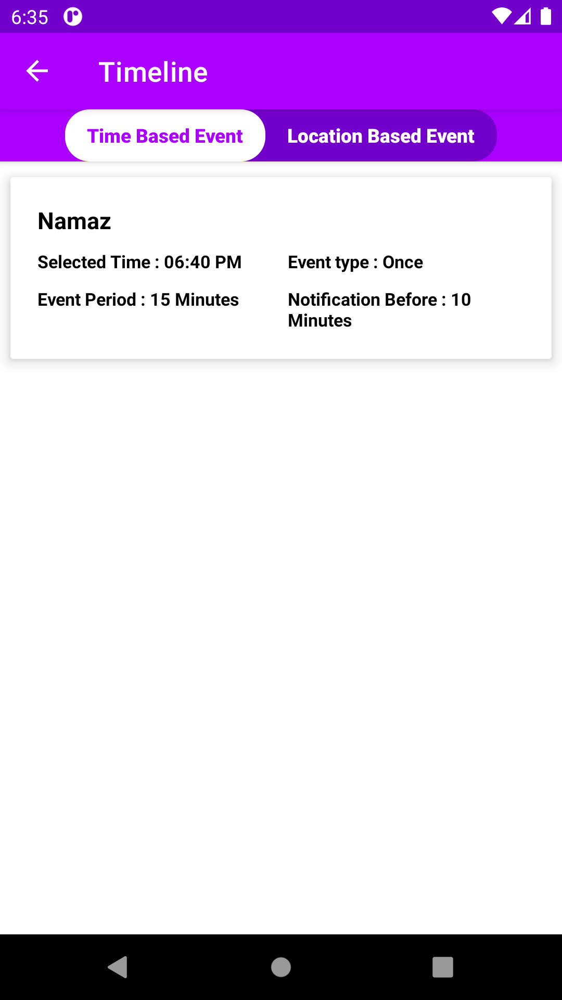
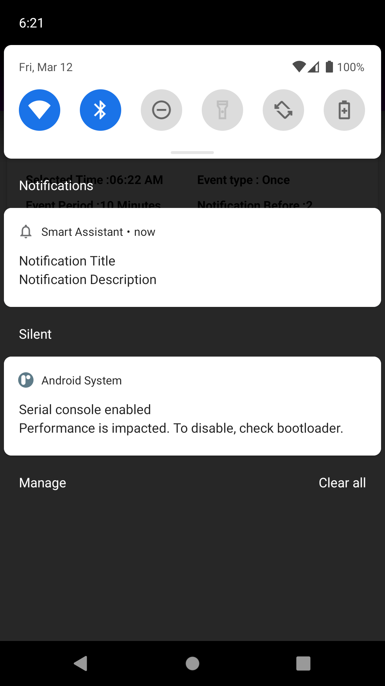

## Smart Silent Assistant Applicatiion

User can create time based event. Phone will be automatically in silent mode at that time based event. An alert notification will be triggered before that event to notify the user there is an upcoming event.
User can also create location based event. In location based event user can select location from Google map and give a range so that when mobile will be on that range, phone will be silent automatically. In addition, when the user is in outside of the range then phone will be in normal mode automatically. When there is an active event that means the phone is in silent mode. During the silent mode if there is an incoming call and the user not received the phone then a user defined message will be sent to that number. 

#### Technology Stack

* MVVM architecture
* Dagger 2
* Work Manager
* Room Database
* Navigation Component
* Alarm Manager
* Async Task
* Broadcast Reciever
* Data Binding

#### Screenshot :

 
 
 
 
 